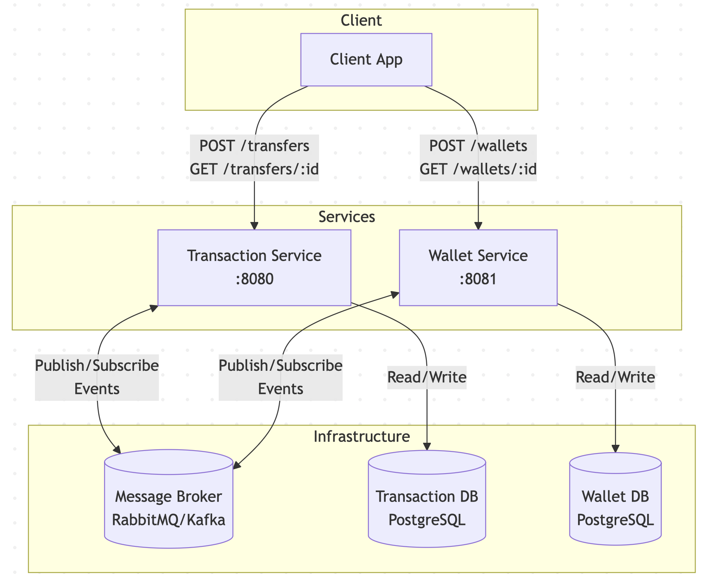
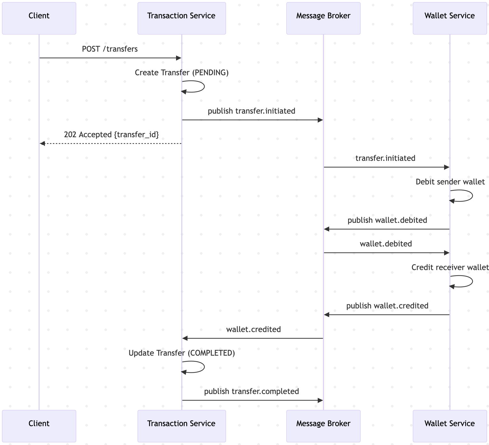
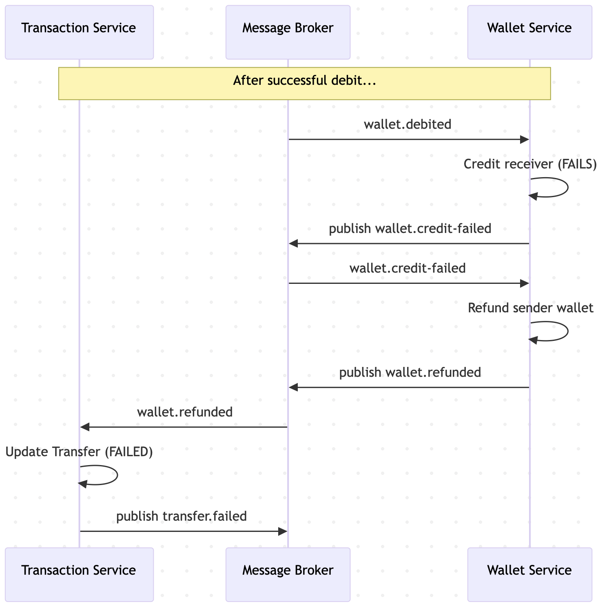
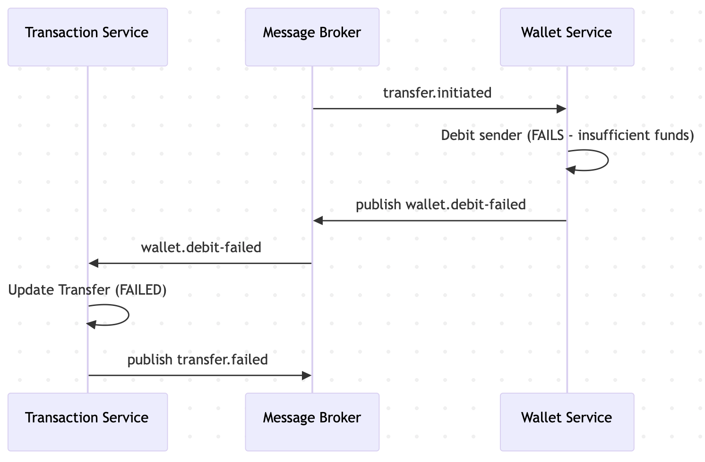

# Distributed Transaction System - Specifications

A wallet-transaction system demonstrating the Saga pattern with choreography.

---

## High-Level Architecture



### Key Design Principles

- **Service isolation**: Each service owns its database (no shared DB)
- **Async communication**: Services communicate via events, not direct calls
- **Choreography**: No central orchestrator; each service reacts to events
- **Idempotency**: All operations are idempotent via transactionId

### Technology Decisions

| Component      | Choice            | Rationale                                                               |
| -------------- | ----------------- | ----------------------------------------------------------------------- |
| Framework      | NestJS (monorepo) | TypeScript, modular architecture, good Kafka support                    |
| Message Broker | Kafka             | Learning opportunity; supports replay and partitioning                  |
| Event Format   | Plain JSON        | Simple; no schema registry overhead                                     |
| Idempotency    | DB-level          | Unique constraint on `(wallet_id, transaction_id)` in WalletLedgerEntry |
| Observability  | Basic             | Structured logging + `/health` endpoints                                |
| Databases      | PostgreSQL        | ACID compliance, CHECK constraints for balance >= 0                     |

### Service Ports

| Service             | HTTP Port | Description            |
| ------------------- | --------- | ---------------------- |
| Transaction Service | 3000      | REST API for transfers |
| Wallet Service      | 3001      | REST API for wallets   |

### DDD Architecture

Each service follows Domain-Driven Design with clear layer separation:

```
apps/{service}/src/
├── domain/                    # Domain Layer (core business logic)
│   ├── entities/              # Domain entities (Wallet, Transfer)
│   ├── value-objects/         # Immutable value types (Money, WalletId)
│   ├── events/                # Domain events
│   ├── services/              # Domain services
│   └── repositories/          # Repository interfaces (ports)
├── application/               # Application Layer (use cases)
│   ├── commands/              # Command handlers (write operations)
│   ├── queries/               # Query handlers (read operations)
│   ├── services/              # Application services
│   └── dtos/                  # Data transfer objects
├── infrastructure/            # Infrastructure Layer (adapters)
│   ├── persistence/           # TypeORM repositories, entities
│   └── messaging/             # Kafka producers/consumers
└── interface/                 # Interface Layer (entry points)
    └── http/                  # REST controllers
```

**Layer Dependencies (Dependency Rule):**

```
Interface → Application → Domain
                ↑
Infrastructure (implements Domain interfaces)
```

**Key DDD Concepts Applied:**

| Concept | Implementation |
| ------- | -------------- |
| Aggregate Root | `Wallet` (owns WalletLedgerEntry), `Transfer` |
| Value Object | `Money`, `WalletId`, `TransferId` |
| Domain Event | `WalletDebited`, `TransferInitiated` |
| Repository | Interface in domain, implementation in infrastructure |
| Domain Service | Business logic spanning multiple aggregates |

### Coding Conventions

#### Input Validation

Use NestJS `ValidationPipe` with `class-validator` decorators for all controller input validation:

```typescript
// main.ts - Enable globally
app.useGlobalPipes(
  new ValidationPipe({
    whitelist: true,           // Strip non-decorated properties
    forbidNonWhitelisted: true, // Error on extra properties
    transform: true,            // Auto-transform to DTO instances
  }),
);

// DTO with validation decorators
export class CreateWalletDto {
  @IsUUID()
  userId!: string;
}
```

#### Object Transformation

Use `class-transformer` with `@Expose()` decorators for all entity/DTO transformations:

```typescript
// Entity with @Expose() decorators
export class Wallet {
  @Expose() readonly walletId: string;
  @Expose() readonly userId: string;
  @Expose() readonly balance: number;
  // ...
}

// Repository: Use plainToInstance for both directions
async save(wallet: Wallet): Promise<Wallet> {
  const ormEntity = plainToInstance(WalletOrmEntity, wallet, {
    excludeExtraneousValues: true,
  });
  const saved = await this.ormRepository.save(ormEntity);
  return plainToInstance(Wallet, saved, { excludeExtraneousValues: true });
}

async findById(walletId: string): Promise<Wallet | null> {
  const entity = await this.ormRepository.findOne({ where: { walletId } });
  return entity
    ? plainToInstance(Wallet, entity, { excludeExtraneousValues: true })
    : null;
}
```

Key options:
- `excludeExtraneousValues: true` - Only include properties with `@Expose()`

#### Type Safety

TypeScript uses structural typing - leverage it instead of excessive type guards:

- Trust typed function parameters and return types
- Use `plainToInstance` with decorated classes for transformations
- Use `satisfies` for object literal type checking without widening

```typescript
// ✅ Good: satisfies for config objects
const config = {
  host: 'localhost',
  port: 5432,
} satisfies DbConfig;

// ✅ Good: Use plainToInstance consistently
const wallet = plainToInstance(Wallet, {
  walletId: randomUUID(),
  userId,
  balance: 0,
  createdAt: now,
  updatedAt: now,
}, { excludeExtraneousValues: true });
```

#### Immutability

Prefer immutability and avoid mutation/side effects:

- **Domain entities**: Use `readonly` for identity fields, private constructor with factory methods
- **Props interfaces**: Mark all properties as `readonly`
- **Object creation**: Use spread/`Object.assign` instead of sequential mutation

```typescript
// ❌ Avoid: Sequential mutation
const response: Record<string, unknown> = { walletId: wallet.walletId };
response['userId'] = wallet.userId;
if (includeUpdatedAt) {
  response['updatedAt'] = wallet.updatedAt;
}

// ✅ Prefer: Spread with conditional
const response = {
  walletId: wallet.walletId,
  userId: wallet.userId,
  ...(includeUpdatedAt && { updatedAt: wallet.updatedAt }),
};

// ❌ Avoid: Field-by-field assignment
const entity = new WalletOrmEntity();
entity.walletId = wallet.walletId;
entity.userId = wallet.userId;

// ✅ Prefer: Object.assign in single expression
return Object.assign(new WalletOrmEntity(), {
  walletId: wallet.walletId,
  userId: wallet.userId,
});
```

---

## 1. Functional Requirements

### Wallet Service

- Create wallet (one per user)
- Query balance
- Debit operation (atomic, constraint-checked)
- Credit operation
- Compensation: refund failed debits

### Transaction Service

- Initiate transfer (saga trigger)
- Query transfer status
- Track saga state machine (PENDING -> DEBITED -> COMPLETED / FAILED)

### Saga Events (Choreography)

- `TransferInitiated` - Transaction Service publishes
- `SenderDebited` / `DebitFailed` - Wallet Service publishes
- `ReceiverCredited` / `CreditFailed` - Wallet Service publishes
- `DebitRefunded` - Wallet Service publishes (compensation)
- `TransferCompleted` / `TransferFailed` - Transaction Service publishes (terminal)

---

## 2. Non-Functional Requirements

- Idempotency via transaction IDs
- Eventual consistency (no distributed locks)
- Fail-fast, client-side retries
- Correlation IDs for distributed tracing
- Containerized local development (Docker Compose)

---

## 3. Out of Scope

- Authentication/authorization
- Multi-currency
- Rate limiting
- External payment integrations

---

## 4. Entities

### Wallet Service

#### Wallet

| Field      | Type      | Description                          |
| ---------- | --------- | ------------------------------------ |
| wallet_id  | UUID      | Primary key                          |
| user_id    | UUID      | Owner (unique constraint)            |
| balance    | BIGINT    | Balance in cents, non-negative       |
| created_at | TIMESTAMP | Creation time                        |
| updated_at | TIMESTAMP | Last update                          |

> **Note:** All monetary amounts are stored in cents (integer) to avoid floating-point precision issues.
> PostgreSQL `bigint` returns as string; use TypeORM column transformer for automatic conversion.

#### WalletLedgerEntry (idempotency + audit)

| Field          | Type      | Description                        |
| -------------- | --------- | ---------------------------------- |
| entry_id       | UUID      | Primary key                        |
| wallet_id      | UUID      | FK to Wallet                       |
| transaction_id | UUID      | Correlation ID (unique per wallet) |
| type           | ENUM      | DEBIT, CREDIT, REFUND              |
| amount         | BIGINT    | Amount in cents                    |
| created_at     | TIMESTAMP | Entry time                         |

**Constraints:**

- Unique constraint on `(wallet_id, transaction_id)` for idempotency
- Foreign key from `wallet_id` to `Wallet.wallet_id`

### Transaction Service

#### Transfer

| Field              | Type      | Description                         |
| ------------------ | --------- | ----------------------------------- |
| transfer_id        | UUID      | PK (saga correlation ID)            |
| sender_wallet_id   | UUID      | Source wallet                       |
| receiver_wallet_id | UUID      | Destination wallet                  |
| amount             | BIGINT    | Transfer amount in cents            |
| status             | ENUM      | PENDING, DEBITED, COMPLETED, FAILED |
| failure_reason     | VARCHAR   | Nullable                            |
| created_at         | TIMESTAMP | Creation time                       |
| updated_at         | TIMESTAMP | Last state change                   |

---

## 5. APIs

### Wallet Service (REST)

| Method | Endpoint               | Description          |
| ------ | ---------------------- | -------------------- |
| POST   | `/wallets`             | Create wallet        |
| GET    | `/wallets/{walletId}`  | Get wallet + balance |

#### POST /wallets

**Request:**

```json
{
  "userId": "uuid"
}
```

**Response (201 Created):**

```json
{
  "walletId": "uuid",
  "userId": "uuid",
  "balance": 0,
  "createdAt": "timestamp"
}
```

#### GET /wallets/{walletId}

**Response (200 OK):**

```json
{
  "walletId": "uuid",
  "userId": "uuid",
  "balance": 10000,
  "createdAt": "timestamp",
  "updatedAt": "timestamp"
}
```

### Transaction Service (REST)

| Method | Endpoint                   | Description       |
| ------ | -------------------------- | ----------------- |
| POST   | `/transfers`               | Initiate transfer |
| GET    | `/transfers/{transferId}`  | Query status      |

#### POST /transfers

**Request:**

```json
{
  "senderWalletId": "uuid",
  "receiverWalletId": "uuid",
  "amount": 5000
}
```

**Response (202 Accepted):**

```json
{
  "transferId": "uuid",
  "senderWalletId": "uuid",
  "receiverWalletId": "uuid",
  "amount": 5000,
  "status": "PENDING",
  "createdAt": "timestamp"
}
```

#### GET /transfers/{transferId}

**Response (200 OK):**

```json
{
  "transferId": "uuid",
  "senderWalletId": "uuid",
  "receiverWalletId": "uuid",
  "amount": 5000,
  "status": "COMPLETED",
  "failureReason": null,
  "createdAt": "timestamp",
  "updatedAt": "timestamp"
}
```

### Event Topics (Kafka)

| Topic                  | Publisher       | Consumers                   | Payload                                              |
| ---------------------- | --------------- | --------------------------- | ---------------------------------------------------- |
| `transfer.initiated`   | Transaction Svc | Wallet Svc                  | transferId, senderWalletId, receiverWalletId, amount |
| `wallet.debited`       | Wallet Svc      | Wallet Svc, Transaction Svc | transferId, walletId                                 |
| `wallet.debit-failed`  | Wallet Svc      | Transaction Svc             | transferId, walletId, reason                         |
| `wallet.credited`      | Wallet Svc      | Transaction Svc             | transferId, walletId                                 |
| `wallet.credit-failed` | Wallet Svc      | Wallet Svc                  | transferId, walletId, reason                         |
| `wallet.refunded`      | Wallet Svc      | Transaction Svc             | transferId, walletId                                 |
| `transfer.completed`   | Transaction Svc | (External)                  | transferId                                           |
| `transfer.failed`      | Transaction Svc | (External)                  | transferId, reason                                   |

---

## 6. Saga Flow

### Happy Path (Transfer Success)



**Sequence:**

1. Client -> POST /transfers -> Transaction Service
2. Transaction Service creates Transfer (PENDING), publishes `transfer.initiated`
3. Wallet Service debits sender, publishes `wallet.debited`
4. Wallet Service credits receiver, publishes `wallet.credited`
5. Transaction Service updates Transfer (COMPLETED), publishes `transfer.completed`

### Compensation Path (Credit Fails)



**Sequence:**

1. After successful debit, credit to receiver fails
2. Wallet Service publishes `wallet.credit-failed`
3. Wallet Service refunds sender (compensation), publishes `wallet.refunded`
4. Transaction Service updates Transfer (FAILED), publishes `transfer.failed`

### Early Failure Path (Debit Fails)



**Sequence:**

1. Debit fails (insufficient funds, wallet not found)
2. Wallet Service publishes `wallet.debit-failed`
3. Transaction Service updates Transfer (FAILED), publishes `transfer.failed`
4. No compensation needed (nothing to rollback)

---

## 7. Learning Roadmap

Subsequent phases to deepen distributed systems understanding, ordered by foundational value:

### Phase 5: Dead Letter Queue (DLQ) & Retry

**Problem**: Currently, if `handleWalletCreditFailed` refund fails, we log a critical error but the message is committed. This causes silent data inconsistency—sender is debited but never refunded.

**Systems Concepts**:
- Failure isolation and poison message handling
- Retry strategies (immediate vs exponential backoff)
- Operational alerting for manual intervention

**Design**:

| Component | Description |
|-----------|-------------|
| DLQ Topics | `*.dlq` suffix (e.g., `wallet.credit-failed.dlq`) |
| Retry Policy | 3 retries with exponential backoff (100ms, 200ms, 400ms) |
| DLQ Routing | After max retries, route to DLQ with original payload + error metadata |
| Admin API | `GET /admin/dlq` - list DLQ messages; `POST /admin/dlq/{id}/replay` - retry message |

**DLQ Message Schema**:
```typescript
interface DlqMessage {
  originalTopic: string;
  originalPayload: unknown;
  errorMessage: string;
  errorStack: string;
  attemptCount: number;
}
```

**Success Criteria**:
- Refund failures land in DLQ with full context
- Admin can replay DLQ messages
- Replayed messages respect idempotency (no double-refund)

---

### Phase 6: Saga Timeout & Stuck State Recovery

**Problem**: If `wallet.debited` is published but `wallet.credited`/`wallet.credit-failed` is never received (network partition, consumer crash), the transfer stays in `DEBITED` forever.

**Systems Concepts**:
- Distributed state machine design
- Failure detection vs failure occurrence
- Scheduled job patterns for distributed systems

**Design**:

| Field | Type | Description |
|-------|------|-------------|
| `timeout_at` | TIMESTAMP | When saga should be considered stuck (created_at + timeout) |

**Timeout Configuration**:
```typescript
const SAGA_TIMEOUT_MS = 60_000; // 1 minute for learning; production would be longer
```

**Recovery Strategy**:

| Current Status | Timeout Action | Rationale |
|----------------|----------------|-----------|
| `PENDING` | → `FAILED` | Debit never happened, safe to fail |
| `DEBITED` | → Trigger compensation | Must refund sender |

**Scheduled Job**:
```sql
-- Find stuck sagas
SELECT transfer_id, status FROM transfers
WHERE status IN ('PENDING', 'DEBITED')
  AND timeout_at < NOW();
```

**Success Criteria**:
- Transfers stuck in `DEBITED` for > timeout are auto-compensated
- Transfers stuck in `PENDING` are marked `FAILED`
- Manual test: kill Wallet Service mid-saga, observe timeout recovery

---

### Phase 7: Outbox Pattern for Reliable Event Publishing

**Problem**: Current flow has a dual-write bug:
```
1. Update database (Transfer status)
2. Publish to Kafka
```
If step 1 succeeds but step 2 fails (Kafka down, network issue), we have inconsistency: database says `DEBITED`, but no event was published.

**Systems Concepts**:
- Dual-write problem
- Exactly-once vs at-least-once semantics
- Transactional outbox pattern
- Change Data Capture (CDC) concepts

**Design**:

**Outbox Table** (per service):
```sql
CREATE TABLE outbox (
  id UUID PRIMARY KEY,
  aggregate_type VARCHAR(255) NOT NULL,  -- 'Transfer', 'Wallet'
  aggregate_id UUID NOT NULL,            -- transferId, walletId
  event_type VARCHAR(255) NOT NULL,      -- 'TransferInitiated', 'WalletDebited'
  payload JSONB NOT NULL,
  created_at TIMESTAMP NOT NULL DEFAULT NOW(),
  published_at TIMESTAMP NULL            -- NULL = not yet published
);

CREATE INDEX idx_outbox_unpublished ON outbox(created_at) WHERE published_at IS NULL;
```

**Flow Change**:
```
Before (dual-write):
  1. BEGIN transaction
  2. UPDATE transfer SET status = 'DEBITED'
  3. COMMIT
  4. kafkaProducer.publish(event)  -- Can fail after commit!

After (outbox):
  1. BEGIN transaction
  2. UPDATE transfer SET status = 'DEBITED'
  3. INSERT INTO outbox (event_type, payload, ...)
  4. COMMIT  -- Both or neither
  5. [Background] Outbox publisher polls & publishes
```

**Outbox Publisher Options**:
1. **Polling** (simpler): Scheduled job every 100ms queries unpublished, publishes, marks published
2. **CDC** (advanced): Debezium captures outbox inserts, routes to Kafka

**Success Criteria**:
- No event is lost even if Kafka is temporarily unavailable
- Events are published in order (per aggregate)
- Manual test: pause Kafka, create transfer, resume Kafka, observe eventual delivery

---

### Phase 8: Distributed Tracing

**Problem**: With DLQ, timeouts, and outbox, debugging production issues requires tracing requests across services and async boundaries.

**Systems Concepts**:
- Correlation ID propagation
- OpenTelemetry instrumentation
- Trace context across async boundaries (Kafka)

**Design**:

**Trace Context**:
```typescript
interface TraceContext {
  traceId: string;    // Unique per user request
  spanId: string;     // Unique per operation
  parentSpanId?: string;
}
```

**Propagation**:
- HTTP: `traceparent` header (W3C Trace Context)
- Kafka: Message headers carry trace context

**Infrastructure**:
- Add Jaeger to docker-compose
- OpenTelemetry SDK for NestJS
- Auto-instrumentation for HTTP, Kafka, TypeORM

**Success Criteria**:
- Single trace shows full saga flow across both services
- Kafka event hops visible in trace
- Latency breakdown per operation

---

## 8. Implementation Approach

Using incremental development with TDD (test-driven development):

### Phase 0: Infrastructure Setup ✅

- Docker Compose with PostgreSQL, Kafka
- Service scaffolding with health checks
- CI pipeline for running tests

### Phase 1: Wallet Service (CRUD) ✅

1. Write e2e tests: create wallet, get wallet, verify balance constraints
2. Implement Wallet entity + REST endpoints
3. Assert e2e tests pass

### Phase 2: Transaction Service (Transfer Initiation) ✅

1. Write e2e tests: create transfer, query transfer status
2. Implement Transfer entity + REST endpoints
3. Assert e2e tests pass

### Phase 3: Event Integration (Happy Path) ✅

1. Write e2e test: full transfer flow (initiate -> debit -> credit -> complete)
2. Implement event publishers and handlers
3. Assert e2e tests pass

### Phase 4: Compensation Flow ✅

1. Write e2e tests: debit failure, credit failure with refund
2. Implement compensation handlers
3. Assert e2e tests pass

---

### Phase 5: DLQ & Retry (Upcoming)

1. Write e2e test: simulate refund failure, verify message lands in DLQ
2. Implement retry with exponential backoff
3. Implement DLQ routing after max retries
4. Add admin API for DLQ inspection and replay
5. Assert e2e tests pass

### Phase 6: Saga Timeout (Upcoming)

1. Write e2e test: create transfer, prevent completion, verify timeout recovery
2. Add `timeout_at` column to Transfer entity
3. Implement scheduled job to detect stuck sagas
4. Implement timeout handling (fail PENDING, compensate DEBITED)
5. Assert e2e tests pass

### Phase 7: Outbox Pattern (Upcoming)

1. Write e2e test: pause Kafka, create transfer, resume, verify eventual consistency
2. Create outbox table and repository
3. Refactor event publishing to write to outbox in same transaction
4. Implement background outbox publisher
5. Assert e2e tests pass

### Phase 8: Distributed Tracing (Upcoming)

1. Add Jaeger to docker-compose
2. Instrument HTTP controllers with OpenTelemetry
3. Propagate trace context through Kafka message headers
4. Instrument Kafka producers/consumers
5. Verify end-to-end trace in Jaeger UI

---

### TDD Workflow (per phase)

```
1. RED:   Write failing e2e test asserting expected behavior
2. GREEN: Implement minimal code to pass the test
3. REFACTOR: Clean up while keeping tests green
```
